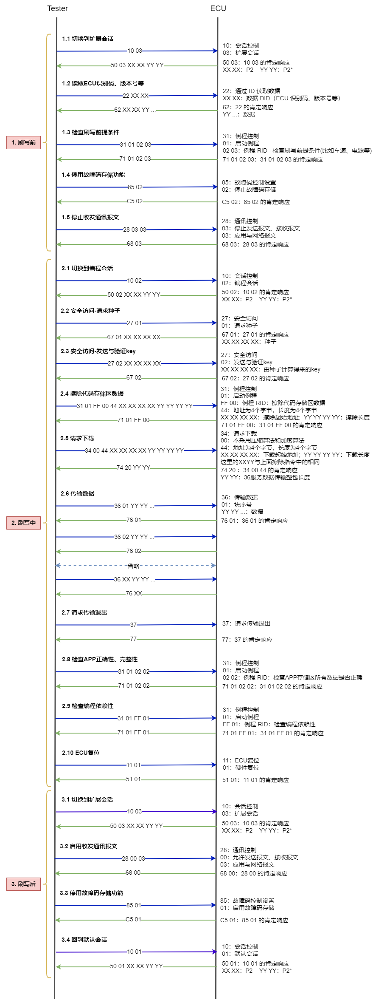

# UDS 诊断协议栈
* C 语言实现，专为小型嵌入式设备打造，可轻松实现将设备接入 CAN/LIN 网络

## 源码说明
* UDS 诊断协议栈相关源码位于 "UDS_For_STM32MP157/CM4/UDSBase" 和 "UDS_For_STM32MP157/CM4/UDSLogic" 这两个目录下
* 先说 "UDSBase" 目录下的源码文件，其中核心文件有两个，分别是 "uds_tp.c" 和 "uds_service.c"
* 比如当我们想向外发送 100 个字节数据的时候，由于物理硬件的限制（CAN 一帧最多只能发送 8 个字节的数据），我们是没用办法把这 100 个字节的数据一次性全部发送出去的，这时候我们不得不将一整包数据拆分，然后一帧一帧地发送出去，"uds_tp.c" 就是实现这个拆分功能的，比如给每一帧添加一个帧序号等等，这样子接收方才能够准确的将接收到的数据完整的还原成一整包数据；有发送就有接收，"uds_tp.c" 还能将接收到的多帧数据拼接组装，去除帧序号等辅助信息，最后形成一整包完整的有效数据，再将其传送到上层或应用层去处理。"uds_tp.c" 的实现是完全遵循 ISO 15765-2 协议的
* 经 "uds_tp.c" 处理过的数据将继续交由 "uds_service.c" 处理，其实 "UDSLogic" 目录下的所有源码从层次划分来讲都应该是属于 "uds_service.c" 的，然而我们还是拆分出来 "UDSLogic"，其原因有两个，一是如果代码都写到 "uds_service.c" 文件中，那么这个文件就会变得过于臃肿，代码阅读起来就不是那么容易了；二是我们想将业务无关代码部分拆分出来，"UDSBase" 下的代码属于业务无关代码，使用者甚至完全不需要理解这部分代码是如何实现的，"UDSLogic" 目录下的代码属于业务相关代码，针对不同的业务需求这里面的代码可能是需要变动的，为了能够更快速的定位代码，我们也根据服务 ID 号做了功能拆分，每个服务单独对应一个 .c 文件，即便是不打开文件的情况下我们也可以根据文件名称快速定位到需要的位置

## 移植与使用
* 移植的第一步就是将 "UDSBase" 和 "UDSLogic" 这两个目录下的所有源码都添加到目标工程中，因为 "UDSLogic" 目录下的代码跟业务相关，所以可能会出现编译错误的情况，这时候只要把错误代码全部注释掉，后面再根据具体的业务需求填充和完善即可，注意这部分代码的实现要遵循 ISO 14229 协议
* 移植第二步，打开 "UDSBase" 下的 "uds_port.h" 文件，这里面包含着移植所需要关注的所有地方，首先就是对接物理硬件的收发，当硬件接收到一帧数据后，需调用 uds_recv_frame() 函数将数据传递给协议栈处理，除此之外我们还需要重新实现物理硬件的发送函数 uds_send_frame()
* 物理硬件的收发对接完成后并不是意味着协议栈就已经能正常工作了，我们还需要将 uds_1ms_task() 函数放到 1ms 定时器中周期调用，除此之外不能忘了调用 uds_init() 对诊断协议栈进行初始化
* 最后，我们需要根据实际业务需求更改下面 3 个宏
  ```c
  #define REQUEST_ID        0x123           // 请求 ID
  #define FUNCTION_ID       0x7DF           // 功能 ID
  #define RESPONSE_ID       0x456           // 应答 ID
  ```
* 这套协议栈不光能适配 CAN 总线，想要适配 LIN 总线只需要将 FRAME_SIZE 宏改为 7 即可；想要适配 CANFD 总线只需要将 FRAME_SIZE 宏改为 64 即可
* 如果需要新增服务处理，则首先在 "service_cfg.c" 中添加配置，然后再实现具体的服务处理代码，注意这部分代码的实现要遵循 ISO 14229 协议
* 考虑到极端情况，比如连续收到两帧数据之间的间隔过短，从而导致数据来不及处理时，我们可以在物理硬件收发数据之上构建循环缓冲区，关于循环缓冲区相关代码我们并没有添加到协议栈中，如有需要，可自行添加：[ring.h](./UDS_For_STM32MP157/CM4/RingBuf/ring.h)、[msg_buf.c](./UDS_For_STM32MP157/CM4/RingBuf/msg_buf.c)、[msg_buf.h](./UDS_For_STM32MP157/CM4/RingBuf/msg_buf.h)


## UDS诊断刷写流程图
  
